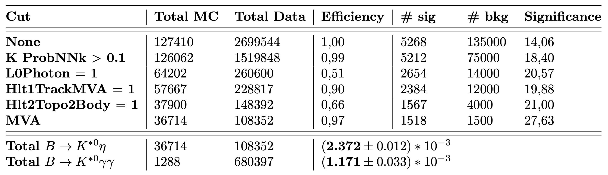
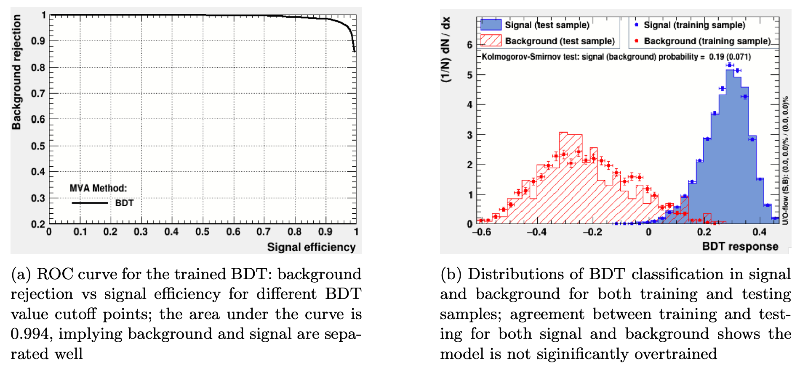
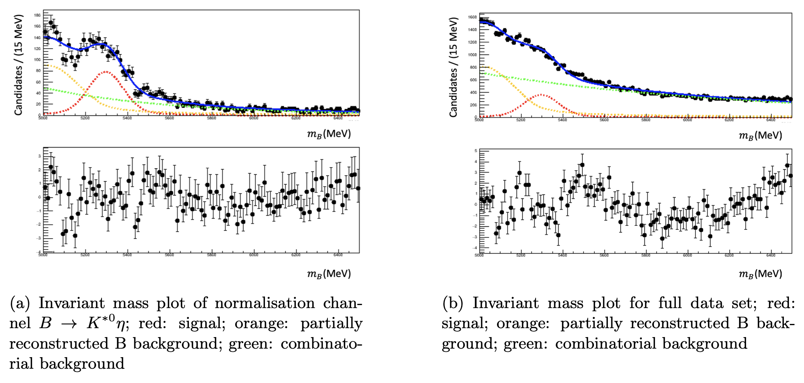
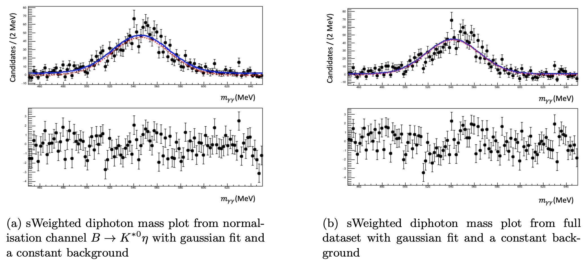

# Axion-like particle search

This repository contains a collection of analysis and fitting workflows for a search for **Axion-Like Particles (ALPs)** decaying into two photons ($a \to \gamma\gamma$), using LHCb data and Monte Carlo simulations. The simulated samples include other known diphoton decays, which act as physics backgrounds to the ALP signal.

The folders are organized as self-contained examples covering data preparation, blind analysis steps, machine-learning-based event selection, and fitting/optimisation scripts.

## Analysis overview

The search proceeds in three main stages:

### 1. Filtering

A set of selection cuts is applied to reject as much background as possible while retaining as much signal as possible. Each cut is evaluated in terms of its effect on signal and background yields and on the overall significance:

*Table: cumulative effect of each selection cut on Monte Carlo and data yields, signal/background counts, and significance. The final significance after all cuts (including the MVA selection) reaches 27.63, up from 14.06 with no selection applied.*

### 2. Multivariate classification (AdaBoost)

After the initial filtering, an AdaBoost-based BDT (boosted decision tree) is trained to further separate signal from background:

*(a) ROC curve for the trained BDT — background rejection vs. signal efficiency across BDT cutoff values, with an area under the curve of 0.994, indicating strong separation between signal and background. (b) BDT response distributions for signal and background in both training and testing samples; the close agreement between training and testing samples (Kolmogorov–Smirnov probabilities of 0.19 for signal and 0.071 for background) shows the model is not significantly overtrained.*

### 3. Fitting and isolation with ROOT and sWeights

Finally, `ROOT` and the `sWeights`/`sPlot` technique are used to fit signal and background components to data and statistically isolate the signal contribution.

**Invariant mass fits:**

*(a) Invariant mass fit for the normalisation channel $B \to K^{*0}\eta$, and (b) invariant mass fit for the full dataset. Red: signal component; orange: partially reconstructed B background; green: combinatorial background. Residuals (pulls) are shown below each fit.*

**sWeighted diphoton mass plots:**

*(a) sWeighted diphoton mass distribution from the normalisation channel $B \to K^{*0}\eta$, and (b) sWeighted diphoton mass distribution from the full dataset, each with a Gaussian signal fit over a constant background. Residuals (pulls) are shown below each plot.*

## Repository layout

- `basic/`: simple reduced-data creation and basic analysis examples
- `data-blind-creator/`: blind-data preparation workflow
- `mc-blind-creator/`: blind Monte Carlo preparation workflow
- `mva-blind/`: blinded MVA-style analysis example
- `python-true/`: additional Python-based analysis pipelines for blind and unblind workflows
- `s-optimiser-blind/`: trigger/selection optimisation studies for blind analyses

## Getting started

Most subprojects follow the same pattern:

1. Change into the relevant project directory.
2. Source the local setup script if required:
   - `source setup.sh`
3. Run the example entrypoint:
   - `python python/runme.py`

The example data files are stored in each project's `data/` directory.

## Requirements

These workflows are built around:

- Python
- ROOT
- shell setup scripts provided in each subproject

## Notes

The repository is organized as a set of example pipelines rather than a single packaged application. For a first pass, start with the basic examples in `basic/`, then move on to the filtering, BDT training, and fitting stages described above, and finally the more specialised blind/unblind workflows.
